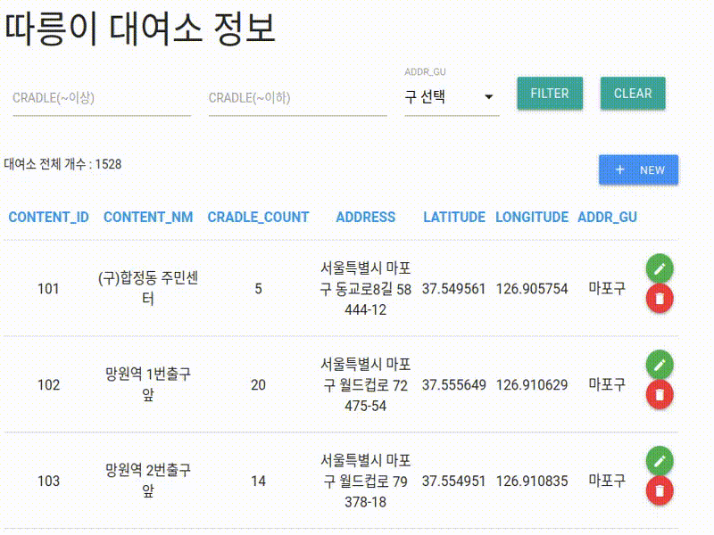
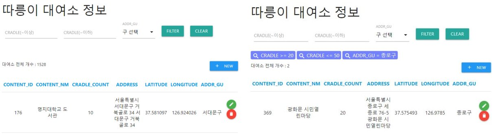

# seoulbike-data-platform

## Requirements

> 따릉이 자전거 데이터

API 제공 URL : http://data.seoul.go.kr/dataList/datasetView.do?infId=OA-15493&srvType=A&serviceKind=1

[데이터 관련 정리](https://github.com/yahwang/seoulbike-data-platform/tree/master/Data_API)

> Web Page

    python == 3.6.8

    Django == 2.2.2
    django-bootstrap-form==3.4
    django-environ==0.4.5
    django-extensions==2.1.9
    django-filter==2.1.0
    django-rest-swagger==2.2.0
    django-tables2==2.0.6
    djangorestframework==3.9.4

> airflow 1.10.3

Using Custom Docker

https://github.com/yahwang/docker-airflow

[DAG 파일](https://github.com/yahwang/seoulbike-data-platform/tree/master/dags/api_to_save.py)

> superset 0.28.1

Using Custom Docker

https://github.com/yahwang/docker-superset

## Preview

> Dashboard

> Filter

## Stations Info CRUD

> RETRIEVE & FILTER

> CREATE & UPDATE

